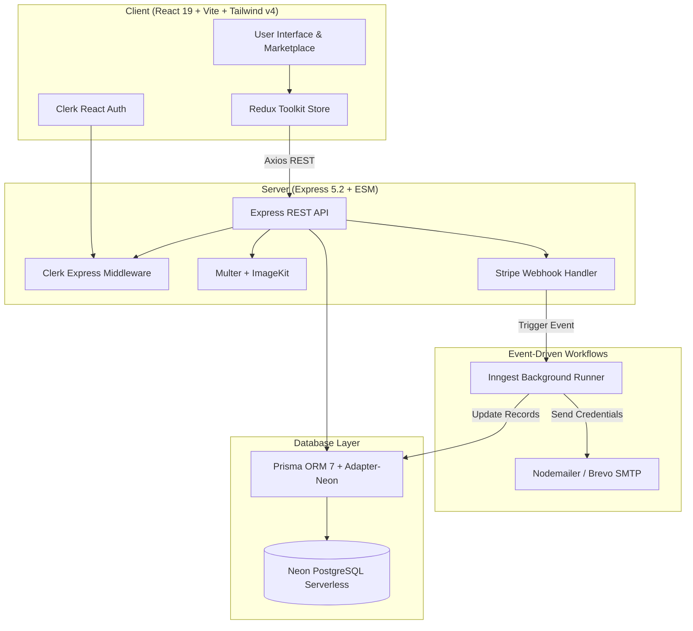

# Profileza 🚀

> **A Secure, Full-Stack Marketplace for Buying and Selling Verified Social Media Profiles and Digital Assets.**

[](https://react.dev/)
[](https://expressjs.com/)
[](https://www.prisma.io/)
[](https://neon.tech/)
[](https://tailwindcss.com/)
[](https://clerk.com/)
[](https://stripe.com/)
[](https://www.inngest.com/)
[](https://vercel.com/)

---

## 📖 Overview

**Profileza** is an end-to-end digital escrow and marketplace platform designed to bridge the trust gap between buyers and sellers of social media properties across **YouTube, Instagram, TikTok, Facebook, Twitter (X), LinkedIn, Pinterest, Snapchat, Twitch, and Discord**.

The platform provides a complete escrow verification pipeline: sellers list verified profiles and submit ownership credentials, our admin team audits and secures the assets, and buyers purchase through Stripe Checkout with automated credential dispatch orchestrated by Inngest.

---

## 🏛️ System Architecture



---

## ✨ Key Features

### 🛒 Buyer Experience
- **Filtered Discovery**: Browse listings filtered by platform, niche (Tech, Gaming, Lifestyle, etc.), price range, followers, and engagement rate.
- **Detailed Metrics**: Inspect profile stats, audience demographics, monthly views, and monetization/verification status.
- **Direct Buyer-Seller Chat**: In-app messaging system to communicate with the seller before purchasing.
- **Stripe Checkout**: Safe escrow checkout supporting card payments with token amount and platform assurance.
- **Automated Delivery**: Upon successful payment, updated account credentials are automatically delivered to the buyer's email.

### 💼 Seller Experience
- **Listing Creation**: Upload up to 5 screenshots processed and stored via ImageKit.
- **Tiered Listing System**: Free and premium listing quotas with Clerk plan checks.
- **Escrow Credential Submission**: Submit original credentials directly into the secure admin queue.
- **Earnings & Withdrawals**: Live wallet dashboard tracking earned balance and requesting payouts with custom account details.

### 🛡️ Admin Escrow & Verification Panel
- **Dedicated Admin Hub**: Accessible only to whitelisted admin emails (`ADMIN_EMAILS`).
- **Audit Queue**: Review unverified listings, inspect credentials, and verify asset legitimacy.
- **Credential Transfer**: Securely change original credentials to escrow credentials before releasing to buyers.
- **Financial Ledger**: Inspect all transaction histories and mark withdrawal requests as fulfilled.

### ⚡ Event-Driven Automation (Inngest)
- **User Sync**: Real-time two-way synchronization between Clerk users and the Neon database (`clerk/user.created`, `clerk/user.updated`, `clerk/user.deleted`).
- **Post-Purchase Automation**: Automatically updates listing status to `sold`, increments seller balance, and sends the credential package via email.
- **Listing Deletion Cleanup**: Dispatches old credentials back to the owner if a listing is rejected or removed.

---

## 🛠️ Tech Stack

### Frontend (`client/`)
| Technology | Description |
|---|---|
| **React 19** | Latest UI component architecture with hooks and concurrent rendering |
| **Vite 8** | Ultra-fast development server and optimized production bundler |
| **Tailwind CSS v4** | Next-generation utility-first styling with `@tailwindcss/vite` |
| **Redux Toolkit** | Centralized application state for listings, user chats, and balances |
| **Clerk React** | Drop-in user authentication, user profiles, and session management |
| **React Router v7** | Declarative client-side routing |
| **Lucide React & React Icons** | Modern UI icon libraries |
| **React Hot Toast** | Notification toast system |
| **Axios** | HTTP client configured with base URL interceptors |

### Backend (`server/`)
| Technology | Description |
|---|---|
| **Express 5.2** | Modern, fast Node.js web server configured as ES Modules |
| **Prisma ORM 7** | Rust-free Prisma Client v7.10 with `@prisma/adapter-neon` |
| **Neon PostgreSQL** | Serverless cloud PostgreSQL with connection pooling |
| **Inngest 4.21** | Event-driven background job orchestration and multi-step workflows |
| **Clerk Express** | JWT authentication and session protection middleware |
| **Stripe SDK** | Secure payment intent and checkout session management |
| **ImageKit** | Media storage and real-time image optimization |
| **Nodemailer + Brevo** | SMTP transactional email delivery |
| **Multer** | Multipart form-data parser for image uploads |

---

## 📁 Repository Structure

```
Profileza/
├── client/                      # Frontend Application (React + Vite)
│   ├── public/                  # Static assets
│   ├── src/
│   │   ├── app/                 # Redux Toolkit store & slices
│   │   │   ├── features/        # chatSlice.js, listingSlice.js
│   │   │   └── store.js         # Redux store config
│   │   ├── components/          # Reusable components (Navbar, ChatBox, Modals...)
│   │   │   └── admin/           # Admin panel components
│   │   ├── configs/             # Axios instance & configuration
│   │   ├── pages/               # Application views
│   │   │   ├── admin/           # Admin dashboard, listings, withdrawals
│   │   │   ├── Home.jsx         # Landing page
│   │   │   ├── Marketplace.jsx  # Listing explorer with filters
│   │   │   ├── ListingDetails.jsx # Detailed single listing view
│   │   │   ├── Messages.jsx     # Chat center
│   │   │   └── ManageListing.jsx# Seller management console
│   │   ├── App.jsx              # Main routes and app entry
│   │   └── main.jsx             # React DOM root
│   ├── package.json
│   ├── vercel.json              # Client SPA routing for Vercel
│   └── vite.config.js
│
├── server/                      # Backend Application (Express + Prisma)
│   ├── configs/                 # Config modules
│   │   ├── imageKit.js          # ImageKit CDN SDK setup
│   │   ├── multer.js            # Memory upload storage
│   │   ├── nodemailer.js        # Brevo SMTP transport
│   │   └── prisma.js            # Prisma Neon driver adapter initialization
│   ├── controllers/             # Business logic handlers
│   │   ├── adminController.js   # Admin operations & statistics
│   │   ├── chatController.js    # Buyer-seller chat & message logic
│   │   ├── listingController.js # Listings CRUD & purchase flow
│   │   └── stripeWebhook.js     # Stripe event processing
│   ├── inngest/                 # Inngest functions and workflow definitions
│   │   └── index.js             # User sync, email dispatches, status jobs
│   ├── middlewares/             # Auth & role protection
│   │   └── authMiddleware.js    # Clerk protect & protectAdmin
│   ├── prisma/                  # Database Schema
│   │   └── schema.prisma        # Models: User, Listing, Chat, Message, etc.
│   ├── routes/                  # Express route declarations
│   │   ├── adminRoutes.js
│   │   ├── chatRoutes.js
│   │   └── listingRoutes.js
│   ├── prisma.config.js         # Prisma ORM 7 datasource config
│   ├── server.js                # Express app entry & serverless export
│   ├── vercel.json              # Serverless API deployment configuration
│   └── package.json
│
└── README.md
```

---

## 🚀 Getting Started

### Prerequisites
- [Node.js](https://nodejs.org/) (v18 or higher; v20+ recommended)
- [npm](https://www.npmjs.com/) or [pnpm](https://pnpm.io/)
- A free [Neon](https://neon.tech/) PostgreSQL Database
- A [Clerk](https://clerk.com/) Application
- A [Stripe](https://stripe.com/) Developer Account
- An [ImageKit](https://imagekit.io/) Account
- An [Inngest](https://www.inngest.com/) Account (or local Dev Server)

---

### 1. Clone the Repository

```bash
git clone https://github.com/ayushbhardwaj96/Profileza.git
cd Profileza
```

---

### 2. Configure Backend (`server/`)

1. **Navigate to the server directory:**
   ```bash
   cd server
   ```

2. **Install dependencies:**
   ```bash
   npm install
   ```

3. **Configure Environment Variables:**
   Create a `.env` file in the `server` directory:

   ```env
   PORT=3000
   NODE_ENV="development"

   # Neon Database Connections
   DATABASE_URL="postgresql://<user>:<password>@<neon-pooler-hostname>/<dbname>?sslmode=require"
   DIRECT_URL="postgresql://<user>:<password>@<neon-direct-hostname>/<dbname>?sslmode=require"

   # Clerk Auth
   CLERK_PUBLISHABLE_KEY=pk_test_...
   CLERK_SECRET_KEY=sk_test_...
   ADMIN_EMAILS="admin@example.com,your-email@gmail.com"

   # Inngest Background Tasks
   INNGEST_EVENT_KEY=your_inngest_event_key
   INNGEST_SIGNING_KEY=your_inngest_signing_key

   # ImageKit CDN
   IMAGEKIT_PUBLIC_KEY=your_imagekit_public_key
   IMAGEKIT_PRIVATE_KEY=your_imagekit_private_key
   IMAGEKIT_URL_ENDPOINT=https://ik.imagekit.io/your_id

   # Stripe Payments
   STRIPE_SECRET_KEY=sk_test_...
   STRIPE_WEBHOOK_SECRET=whsec_...

   # Brevo / SMTP Email
   SMTP_USER=your_smtp_login
   SMTP_PASS=your_smtp_password
   SENDER_EMAIL="support@profileza.com"
   ```

4. **Synchronize Database Schema:**
   ```bash
   npx prisma generate
   npx prisma db push
   ```

5. **Start the backend server:**
   ```bash
   npm run server
   ```
   *Server will run at `http://localhost:3000`.*

---

### 3. Configure Frontend (`client/`)

1. **Open a new terminal and navigate to `client/`:**
   ```bash
   cd client
   ```

2. **Install dependencies:**
   ```bash
   npm install
   ```

3. **Configure Environment Variables:**
   Create a `.env` file in the `client` directory:

   ```env
   VITE_CLERK_PUBLISHABLE_KEY=pk_test_...
   VITE_BASEURL="http://localhost:3000"
   VITE_CURRENCY='$'
   ```

4. **Start the development server:**
   ```bash
   npm run dev
   ```
   *Client will run at `http://localhost:5173`.*

---

## 📡 API Endpoints Overview

| Method | Endpoint | Access | Description |
|---|---|---|---|
| `GET` | `/` | Public | Healthcheck endpoint (`Server is live!`) |
| `GET` | `/api/listing/public` | Public | Fetch all active listings for the marketplace |
| `POST` | `/api/listing` | Private (User) | Create a new listing with image upload |
| `PUT` | `/api/listing` | Private (User) | Update existing listing details |
| `GET` | `/api/listing/user` | Private (User) | Fetch listings created by authenticated user |
| `PUT` | `/api/listing/:id/status` | Private (User) | Toggle listing status (active/inactive) |
| `DELETE`| `/api/listing/:listingId` | Private (User) | Delete an owned listing |
| `POST` | `/api/listing/add-credential` | Private (User) | Submit credentials for escrow audit |
| `GET` | `/api/listing/purchase-account/:id` | Private (User) | Initialize Stripe Checkout session |
| `POST` | `/api/listing/withdraw` | Private (User) | Request wallet balance payout |
| `POST` | `/api/chat` | Private (User) | Create or retrieve chat thread for a listing |
| `GET` | `/api/chat/user` | Private (User) | List all conversations for the user |
| `POST` | `/api/chat/send-message` | Private (User) | Post a message in a conversation |
| `GET` | `/api/admin/dashboard` | Private (Admin) | Retrieve aggregate platform stats & revenue |
| `GET` | `/api/admin/all-listings` | Private (Admin) | Retrieve all platform listings |
| `PUT` | `/api/admin/verify-credential/:id` | Private (Admin) | Mark credentials as verified |
| `PUT` | `/api/admin/change-credential/:id` | Private (Admin) | Update credentials to secured escrow state |
| `GET` | `/api/admin/transactions` | Private (Admin) | Retrieve system transaction history |
| `PUT` | `/api/admin/withdrawal-mark/:id` | Private (Admin) | Approve & mark withdrawal request as paid |
| `POST` | `/api/stripe` | Webhook | Handle `payment_intent.succeeded` |
| `ALL` | `/api/inngest` | Webhook | Inngest event execution and function serve endpoint |

---

## 🚢 Deployment (Vercel)

Both `client` and `server` include custom `vercel.json` configurations ready for deployment.

### Deploying the Backend (`server`)
1. Create a new Project on Vercel pointing to the `server/` root directory.
2. In **Project Settings -> Environment Variables**, add all keys from `server/.env`.
3. The serverless configuration routes all traffic via [`server/vercel.json`](file:///c:/Users/ayush/OneDrive/Desktop/Profileza/server/vercel.json) to `server.js`.

### Deploying the Frontend (`client`)
1. Create a new Project on Vercel pointing to the `client/` root directory.
2. In **Project Settings -> Environment Variables**, set:
   - `VITE_CLERK_PUBLISHABLE_KEY`
   - `VITE_BASEURL` (URL of your deployed backend)
   - `VITE_CURRENCY`
3. [`client/vercel.json`](file:///c:/Users/ayush/OneDrive/Desktop/Profileza/client/vercel.json) handles SPA rewrite rules for React Router v7.

---

## 🤝 Contributing

Contributions, issues, and feature suggestions are welcome!

1. Fork the repository
2. Create your branch (`git checkout -b feature/amazing-feature`)
3. Commit your changes (`git commit -m 'Add some amazing feature'`)
4. Push to the branch (`git push origin feature/amazing-feature`)
5. Open a Pull Request

---

## 📄 License

This project is licensed under the [ISC License](LICENSE).

---

Developed with ❤️ by **[Ayush Bhardwaj](https://github.com/ayushbhardwaj96)**

